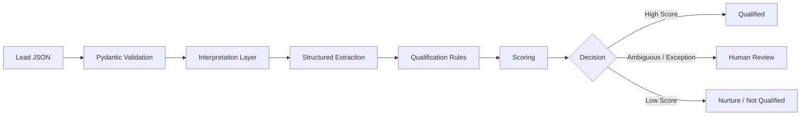

<div align="center">

# 🤖 AI Lead Qualification Engine

### Reference implementation for AI-assisted lead qualification

**Structured Extraction · Deterministic Scoring · Human Review · FastAPI**

A small, runnable reference implementation showing how AI-assisted interpretation can be combined with explicit qualification rules and human-review fallback.

[](#requirements)
[](#api)
[](#testing)
[](LICENSE)

**Maintained by [Prashant Rajput](https://github.com/prashant6788)**  
Founder, [Touchstone Infotech](https://www.touchstoneinfotech.com/)

</div>

---

## What It Does

The engine accepts an inbound lead and returns a structured qualification result.

```text
Incoming Lead
     ↓
Validate Input
     ↓
Interpret Requirement
     ↓
Structured Extraction
     ↓
Deterministic Scoring
     ↓
Qualification Decision
 ┌───────┼──────────┐
Qualified Review   Not Qualified
    ↓       ↓             ↓
Sales   Human /        Nurture
Call    Clarify
```

The project deliberately separates **interpretation** from **business policy**.

- Interpretation extracts information from unstructured input.
- Deterministic rules calculate the score.
- Human review handles ambiguity, unsupported requirements and commercial exceptions.

---

## Why This Architecture?

A common mistake is asking an AI model to make an unrestricted decision such as:

> "Is this a good lead?"

This project instead uses the safer pattern:

```text
AI / Interpreter
↓
Extract structured facts
↓
Validate
↓
Deterministic rules
↓
Decision
↓
Human fallback when needed
```

This makes the workflow easier to test, explain and change.

---

## Architecture



---

## Repository Structure

```text
ai-lead-qualification-engine/
│
├── app/
│   ├── __init__.py
│   ├── main.py
│   ├── models.py
│   ├── qualifier.py
│   ├── rules.py
│   └── ai_service.py
│
├── config/
│   └── qualification-rules.json
│
├── examples/
│   ├── qualified-lead.json
│   ├── review-lead.json
│   └── unqualified-lead.json
│
├── tests/
│   └── test_qualification.py
│
├── .env.example
├── requirements.txt
├── README.md
├── LICENSE
└── .gitignore
```

---

## Qualification Model

The default rules are intentionally simple and configurable.

```json
{
  "supported_services": [
    "seo",
    "crm_automation",
    "ai_automation",
    "paid_media"
  ],
  "scoring": {
    "supported_service": 20,
    "clear_requirement": 20,
    "budget_available": 15,
    "timeline_available": 15,
    "target_location": 15,
    "business_identified": 15
  },
  "thresholds": {
    "qualified": 80,
    "human_review": 50
  }
}
```

These values are **illustrative configuration defaults**, not universal lead-scoring benchmarks.

---

## Human Review

A lead is routed to review when, for example:

- service interest is unclear
- the message contains too little information
- the request is unsupported
- commercial negotiation is detected
- a contractual exception is present

The engine does not invent missing customer information to increase a score.

---

## Requirements

- Python 3.10+
- pip

---

## Installation

Clone the repository:

```bash
git clone https://github.com/prashant6788/ai-lead-qualification-engine.git
cd ai-lead-qualification-engine
```

Create a virtual environment:

### Windows

```bash
python -m venv .venv
.venv\Scripts\activate
```

### macOS / Linux

```bash
python3 -m venv .venv
source .venv/bin/activate
```

Install dependencies:

```bash
pip install -r requirements.txt
```

---

## Run Locally

```bash
uvicorn app.main:app --reload
```

Then open:

```text
http://127.0.0.1:8000/docs
```

FastAPI will provide an interactive API interface.

---

## API

### Health Check

```http
GET /health
```

Response:

```json
{
  "status": "ok"
}
```

### Qualify Lead

```http
POST /qualify
```

Example request:

```json
{
  "name": "Rahul Sharma",
  "company": "Northstar Realty",
  "message": "We generate around 100 enquiries a month and need CRM automation and WhatsApp follow-up.",
  "service_interest": "crm_automation",
  "location": "Gurugram",
  "budget": 50000,
  "timeline": "30 days"
}
```

Example response:

```json
{
  "qualification_status": "qualified",
  "score": 100,
  "service_interest": "crm_automation",
  "requirement_summary": "We generate around 100 enquiries a month and need CRM automation and WhatsApp follow-up.",
  "needs_human_review": false,
  "review_reason": null,
  "recommended_action": "book_sales_call",
  "breakdown": {
    "supported_service": 20,
    "clear_requirement": 20,
    "budget_available": 15,
    "timeline_available": 15,
    "target_location": 15,
    "business_identified": 15
  }
}
```

---

## Try an Example With curl

```bash
curl -X POST "http://127.0.0.1:8000/qualify" \
  -H "Content-Type: application/json" \
  -d @examples/qualified-lead.json
```

On Windows PowerShell, you may prefer FastAPI's `/docs` interface.

---

## Interpretation Layer

V1 uses an offline deterministic `HeuristicAIService`.

This is intentional:

- the repository works without paid API credentials
- tests remain deterministic
- visitors can run the project immediately
- the AI/provider integration remains replaceable

For a production implementation, `app/ai_service.py` can be replaced with a provider-specific structured extraction service.

Keep the same output contract:

```json
{
  "service_interest": "crm_automation",
  "requirement_summary": "Needs CRM and follow-up automation.",
  "location": "Gurugram",
  "timeline": "30 days",
  "budget": 50000,
  "needs_clarification": false,
  "human_review_reason": null
}
```

Downstream business rules should continue to validate the result.

---

## Configuration

Change scoring and supported services in:

```text
config/qualification-rules.json
```

This keeps business policy separate from application code.

---

## Testing

Run:

```bash
pytest
```

The included tests cover:

- clearly qualified lead
- ambiguous lead
- commercial negotiation
- lower-information lead

Add tests whenever qualification rules change.

---

## Security

Do not commit real credentials.

The repository includes:

```text
.env.example
```

but `.env` files are ignored.

For a production system, also consider:

- authentication
- rate limiting
- request logging policy
- PII minimization
- secret management
- CRM permission scope
- webhook verification
- monitoring and alerting

---

## Limitations

This project is a **reference implementation**, not a production CRM product.

V1 intentionally does not include:

- CRM authentication
- GoHighLevel integration
- WhatsApp integration
- database persistence
- user accounts
- frontend UI
- external model API
- production observability

Those can be added as separate integrations without changing the core separation between extraction, rules and human review.

---

## Related Frameworks

### 🤖 AI Automation Playbooks

[github.com/prashant6788/ai-automation-playbooks](https://github.com/prashant6788/ai-automation-playbooks)

Useful related resources:

- AI Lead Qualification Framework
- AI Workflow Design Framework
- AI Agent Human Handoff Framework
- AI Automation QA Checklist

### 🔄 CRM Automation Frameworks

[github.com/prashant6788/crm-automation-frameworks](https://github.com/prashant6788/crm-automation-frameworks)

Useful related resources:

- CRM Strategy Framework
- CRM Lead Routing Framework
- CRM Pipeline Design Framework
- CRM Automation QA Checklist

---

## Design Principles

1. **Extract facts before making decisions.**
2. **Keep business policy deterministic where possible.**
3. **Do not invent missing lead data.**
4. **Use structured outputs.**
5. **Make rules configurable.**
6. **Route ambiguity to humans.**
7. **Keep the system testable without external APIs.**
8. **Separate interpretation from CRM actions.**

---

## License

The software is released under the [MIT License](LICENSE).

---

<div align="center">

### AI Lead Qualification Engine

**Interpretation → Structured Data → Rules → Qualification → Human Review**

Maintained by **[Prashant Rajput](https://github.com/prashant6788)**  
Founder, **[Touchstone Infotech](https://www.touchstoneinfotech.com/)**

</div>
