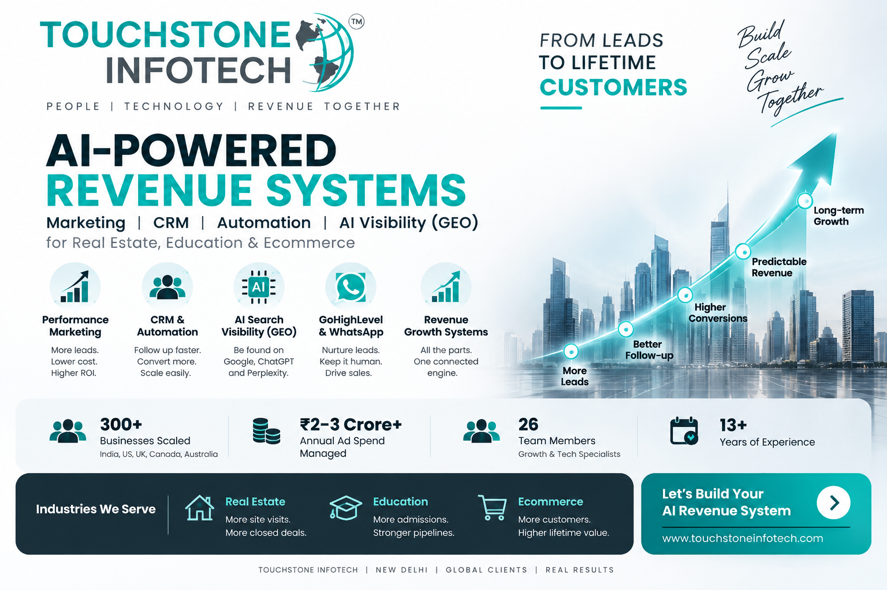
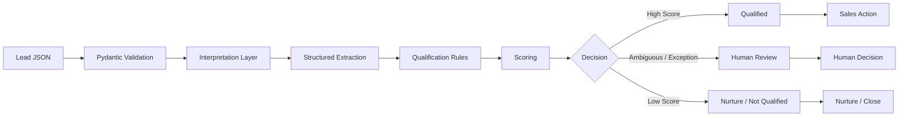

<div align="center">

# 🤖 AI Lead Qualification Engine

### AI-Assisted Lead Qualification with Deterministic Rules & Human Review

**Structured Extraction · Configurable Scoring · Human-in-the-Loop · FastAPI**

A runnable reference implementation showing how AI-assisted interpretation can be combined with explicit business rules to build a transparent, testable lead qualification workflow.

[](#requirements)
[](#api)
[](#testing)
[](#continuous-integration)
[](https://github.com/prashant6788/ai-lead-qualification-engine/releases/tag/v1.0.0)
[](LICENSE)

<br>

**Maintained by [Prashant Rajput](https://github.com/prashant6788)**  
Founder, [Touchstone Infotech](https://www.touchstoneinfotech.com/)

</div>

---

<div align="center">



</div>

<br>

---

> **V1 implementation note:** This version uses a deterministic local interpretation layer so the project can run without external AI credentials. The interpretation layer is designed to be replaceable with an LLM or other AI provider while keeping qualification policy and scoring deterministic.

---

## 🚀 What It Does

The engine accepts an inbound lead and returns a structured qualification decision.

```text
Incoming Lead
      ↓
Input Validation
      ↓
Interpret Requirement
      ↓
Structured Extraction
      ↓
Qualification Rules
      ↓
Deterministic Scoring
      ↓
Qualification Decision
   ┌────────┼─────────┐
   ↓        ↓         ↓
Qualified Review  Not Qualified
   ↓        ↓         ↓
Sales    Human      Nurture
Call     Review
```

The architecture deliberately separates **interpretation** from **business policy**.

- **Interpretation** extracts useful information from lead input.
- **Rules** determine how that information contributes to qualification.
- **Scoring** remains explicit and configurable.
- **Human review** handles ambiguity and exceptions.
- **API responses** provide structured results for downstream systems.

---

## 💡 Why This Architecture?

A common approach is to ask an AI model something like:

> "Is this a good lead?"

That creates an important problem: the AI is being asked to both **interpret the lead** and **define the business decision**.

This project separates those responsibilities.

```text
Interpreter
     ↓
Extract Structured Facts
     ↓
Validate
     ↓
Deterministic Business Rules
     ↓
Qualification Decision
     ↓
Human Review When Required
```

This makes the workflow easier to:

- understand
- test
- audit
- modify
- integrate
- govern

AI can assist interpretation without becoming the uncontrolled source of business policy.

---

## 🏗️ Architecture



### Core Principle

```text
Interpretation ≠ Business Policy
```

The interpretation layer can change independently from the qualification rules.

That means an external AI provider can later replace the local interpreter without requiring the entire qualification system to be redesigned.

---

## 📁 Repository Structure

```text
ai-lead-qualification-engine/
│
├── .github/
│   └── workflows/
│       └── tests.yml
│
├── app/
│   ├── __init__.py
│   ├── main.py
│   ├── models.py
│   ├── qualifier.py
│   ├── rules.py
│   └── ai_service.py
│
├── assets/
│   └── ai-lead-qualification-architecture.png
│
├── config/
│   └── qualification-rules.json
│
├── examples/
│   ├── qualified-lead.json
│   ├── review-lead.json
│   └── unqualified-lead.json
│
├── tests/
│   ├── test_qualification.py
│   └── test_api.py
│
├── .env.example
├── requirements.txt
├── README.md
├── CONTRIBUTING.md
├── LICENSE
└── .gitignore
```

---

## ✅ V1 Status

### Core Engine

- [x] FastAPI REST API
- [x] Structured lead input
- [x] Pydantic validation
- [x] Local interpretation layer
- [x] Structured extraction
- [x] Deterministic qualification scoring
- [x] Configurable business rules
- [x] Human-review fallback
- [x] Qualified / Review / Not Qualified outcomes

### Testing & Documentation

- [x] Example lead payloads
- [x] Business-logic tests
- [x] API endpoint tests
- [x] GitHub Actions automated testing
- [x] Architecture image
- [x] CONTRIBUTING.md
- [x] MIT License
- [x] Local application testing
- [x] V1 GitHub Release

### Future Integrations

- [ ] External LLM provider
- [ ] CRM integration
- [ ] Database persistence
- [ ] Production authentication
- [ ] Production observability

### ✅ V1.0.0 Complete

The first stable release is available here:

**[AI Lead Qualification Engine v1.0.0 →](https://github.com/prashant6788/ai-lead-qualification-engine/releases/tag/v1.0.0)**

V1 focuses on the qualification engine itself. External AI providers, CRM integrations and persistence are intentionally kept outside the core implementation.

---

## 🎯 Qualification Model

Qualification rules live in:

```text
config/qualification-rules.json
```

Default example:

```json
{
  "supported_services": [
    "seo",
    "crm_automation",
    "ai_automation",
    "paid_media"
  ],
  "scoring": {
    "supported_service": 20,
    "clear_requirement": 20,
    "budget_available": 15,
    "timeline_available": 15,
    "target_location": 15,
    "business_identified": 15
  },
  "thresholds": {
    "qualified": 80,
    "human_review": 50
  }
}
```

These values are **illustrative configuration defaults**, not universal lead-scoring benchmarks.

Every business should define qualification rules according to its own:

- ICP
- services
- sales process
- geography
- commercial model
- lead sources
- operational capacity

---

## 🧮 Example Scoring

A complete lead could receive:

| Signal | Score |
|---|---:|
| Supported service | 20 |
| Clear requirement | 20 |
| Budget available | 15 |
| Timeline available | 15 |
| Target location | 15 |
| Business identified | 15 |
| **Maximum** | **100** |

Example thresholds:

```text
80–100  → Qualified
50–79   → Review
0–49    → Not Qualified / Nurture
```

A scoring threshold does **not** override an explicit human-review condition.

For example, a lead could score highly but still require human review because of a commercial or contractual exception.

---

## 👤 Human Review

Human review is a first-class part of the architecture.

A lead may be routed to a human when:

- service interest cannot be identified reliably
- the requirement is ambiguous
- insufficient information is available
- an unsupported requirement is detected
- custom pricing is requested
- commercial negotiation is required
- contractual discussion is detected
- the workflow cannot confidently determine the next action

Example:

```text
Lead Score = 100
       +
Commercial Exception Detected
       ↓
Human Review
```

A high score therefore does not automatically bypass exception handling.

The engine also avoids inventing missing customer information simply to increase a qualification score.

---

## 📥 Example Lead

```json
{
  "name": "Rahul Sharma",
  "company": "Northstar Realty",
  "email": "rahul@example.com",
  "phone": "+919999999999",
  "message": "We generate around 100 enquiries a month and need CRM automation and WhatsApp follow-up.",
  "service_interest": "crm_automation",
  "location": "Gurugram",
  "budget": 50000,
  "timeline": "30 days",
  "lead_source": "google_ads"
}
```

---

## 📤 Example Result

```json
{
  "qualification_status": "qualified",
  "score": 100,
  "service_interest": "crm_automation",
  "requirement_summary": "We generate around 100 enquiries a month and need CRM automation and WhatsApp follow-up.",
  "needs_human_review": false,
  "review_reason": null,
  "recommended_action": "book_sales_call",
  "breakdown": {
    "supported_service": 20,
    "clear_requirement": 20,
    "budget_available": 15,
    "timeline_available": 15,
    "target_location": 15,
    "business_identified": 15
  }
}
```

---

# ⚙️ Installation

## Requirements

- Python 3.10+
- pip

Clone the repository:

```bash
git clone https://github.com/prashant6788/ai-lead-qualification-engine.git
cd ai-lead-qualification-engine
```

---

## Create a Virtual Environment

### Windows

```powershell
python -m venv .venv
.\.venv\Scripts\Activate.ps1
```

If PowerShell blocks activation:

```powershell
Set-ExecutionPolicy -ExecutionPolicy RemoteSigned -Scope Process
```

Then activate again:

```powershell
.\.venv\Scripts\Activate.ps1
```

### macOS / Linux

```bash
python3 -m venv .venv
source .venv/bin/activate
```

---

## Install Dependencies

```bash
python -m pip install --upgrade pip
python -m pip install -r requirements.txt
```

---

# ▶️ Run Locally

Start the API:

```bash
python -m uvicorn app.main:app --reload
```

The API will run at:

```text
http://127.0.0.1:8000
```

Open the interactive FastAPI documentation:

```text
http://127.0.0.1:8000/docs
```

You should see:

```text
GET  /health
POST /qualify
```

---

# 🔌 API

## Health Check

```http
GET /health
```

Response:

```json
{
  "status": "ok"
}
```

---

## Qualify Lead

```http
POST /qualify
```

Example request:

```json
{
  "name": "Rahul Sharma",
  "company": "Northstar Realty",
  "message": "We generate around 100 enquiries a month and need CRM automation and WhatsApp follow-up.",
  "service_interest": "crm_automation",
  "location": "Gurugram",
  "budget": 50000,
  "timeline": "30 days"
}
```

Example response:

```json
{
  "qualification_status": "qualified",
  "score": 100,
  "service_interest": "crm_automation",
  "requirement_summary": "We generate around 100 enquiries a month and need CRM automation and WhatsApp follow-up.",
  "needs_human_review": false,
  "review_reason": null,
  "recommended_action": "book_sales_call",
  "breakdown": {
    "supported_service": 20,
    "clear_requirement": 20,
    "budget_available": 15,
    "timeline_available": 15,
    "target_location": 15,
    "business_identified": 15
  }
}
```

---

## Invalid Input

FastAPI automatically validates the request using Pydantic.

Invalid input returns:

```text
HTTP 422
```

This prevents malformed lead data from reaching the qualification logic.

---

# 🧠 Interpretation Layer

V1 uses the local:

```text
HeuristicAIService
```

defined in:

```text
app/ai_service.py
```

Despite the class name, V1 does **not require an external AI model**.

This design is intentional because it means:

- the repository runs without paid API credentials
- tests remain deterministic
- anyone can run the project immediately
- no external AI dependency is required
- the interpretation layer remains replaceable

The interpretation layer returns structured information such as:

```json
{
  "service_interest": "crm_automation",
  "requirement_summary": "Needs CRM and follow-up automation.",
  "location": "Gurugram",
  "timeline": "30 days",
  "budget": 50000,
  "needs_clarification": false,
  "human_review_reason": null
}
```

A future LLM integration should maintain this structured contract.

The qualification engine can then continue applying deterministic business rules regardless of which interpretation provider is used.

---

# 🔄 AI vs Rules vs Humans

The architecture intentionally gives each layer a different responsibility.

| Layer | Responsibility |
|---|---|
| Interpretation | Understand unstructured lead information |
| Structured Output | Convert interpretation into defined fields |
| Rules | Apply business qualification policy |
| Scoring | Calculate explicit qualification score |
| Human | Handle ambiguity and exceptions |
| API | Return structured outcome to downstream systems |

This separation reduces unnecessary dependence on probabilistic model behavior.

---

# 🧪 Testing

Run all tests:

```bash
python -m pytest -q
```

The test suite covers:

- clearly qualified lead
- ambiguous lead
- commercial negotiation
- lower-information lead
- health endpoint
- qualification endpoint
- invalid API input
- human-review API response

Tests should be added whenever qualification behavior changes.

---

## 🔁 Continuous Integration

The repository includes:

```text
.github/workflows/tests.yml
```

GitHub Actions is configured to test against:

```text
Python 3.10
Python 3.11
Python 3.12
```

on pushes and pull requests to `main`.

This helps verify that changes do not break the qualification engine.

---

# 🔧 Configuration

Business rules should be changed in:

```text
config/qualification-rules.json
```

rather than being scattered throughout application code.

This allows teams to modify:

- supported services
- scoring weights
- qualification thresholds

without redesigning the API.

---

# 🔐 Security

Never commit real credentials.

The repository includes:

```text
.env.example
```

while local `.env` files are ignored by Git.

For production implementations, also consider:

- API authentication
- authorization
- rate limiting
- webhook verification
- PII minimization
- encryption
- secret management
- CRM permission scope
- request logging policy
- monitoring
- alerting
- retention policies

Real customer data should not be committed to the repository.

---

# ⚠️ Limitations

This repository is a **reference implementation**, not a production CRM or autonomous sales system.

V1 intentionally does not include:

- external LLM API
- CRM authentication
- GoHighLevel integration
- WhatsApp integration
- database persistence
- user accounts
- frontend application
- production authentication
- production observability

These can be implemented as separate integration layers without changing the fundamental architecture.

---

# 🛣️ Potential Future Extensions

Useful future extensions could include:

```text
External LLM
     ↓
Structured Extraction
     ↓
Qualification Engine
     ↓
CRM
     ↓
Lead Routing
     ↓
Sales Workflow
```

Possible additions:

- OpenAI or other LLM structured extraction
- CRM webhook integration
- lead-routing engine
- configurable ICP profiles
- database persistence
- audit history
- API authentication
- observability
- CRM outcome feedback

Future functionality should be added only where it provides meaningful implementation value.

---

# 🔗 Related Frameworks

## 🤖 AI Automation Playbooks

**[Explore AI Automation Playbooks →](https://github.com/prashant6788/ai-automation-playbooks)**

Related resources include:

- AI Lead Qualification Framework
- AI Workflow Design Framework
- AI Agent Human Handoff Framework
- AI Automation QA Checklist
- AI Automation Measurement Framework

---

## 🔄 CRM Automation Frameworks

**[Explore CRM Automation Frameworks →](https://github.com/prashant6788/crm-automation-frameworks)**

Related resources include:

- CRM Strategy Framework
- Lead Lifecycle Framework
- CRM Lead Routing Framework
- CRM Pipeline Design Framework
- CRM Automation QA Checklist

---

# 🧭 Design Principles

1. **Extract facts before making decisions.**
2. **Keep interpretation separate from business policy.**
3. **Keep qualification rules explicit and testable.**
4. **Do not invent missing lead information.**
5. **Prefer structured outputs.**
6. **Make business rules configurable.**
7. **Route ambiguity and exceptions to humans.**
8. **Keep the core system runnable without external APIs.**
9. **Separate qualification from downstream CRM actions.**
10. **Test changes to qualification behavior.**

---

# 🤝 Contributing

Contributions are welcome for:

- qualification logic improvements
- additional tests
- validation
- documentation
- human-review patterns
- provider integrations
- security improvements

Please read **[CONTRIBUTING.md](CONTRIBUTING.md)** before submitting a pull request.

Do not submit real customer data, API keys, credentials or fabricated performance claims.

---

# 📦 Release

The first stable release is:

### [v1.0.0 — AI Lead Qualification Engine](https://github.com/prashant6788/ai-lead-qualification-engine/releases/tag/v1.0.0)

This release represents the completed V1 reference implementation.

Future breaking changes should use a new major release. Smaller compatible improvements can be introduced through later minor or patch releases.

---

# 📄 License

This software is released under the [MIT License](LICENSE).

---

<div align="center">

## 🤖 AI Lead Qualification Engine

**Interpretation → Structured Data → Rules → Qualification → Human Review**

A practical reference implementation for building more transparent and testable AI-assisted revenue workflows.

<br>

Maintained by **[Prashant Rajput](https://github.com/prashant6788)**  
Founder, **[Touchstone Infotech](https://www.touchstoneinfotech.com/)**

<br>

[AI Automation Playbooks](https://github.com/prashant6788/ai-automation-playbooks)
·
[CRM Automation Frameworks](https://github.com/prashant6788/crm-automation-frameworks)
·
[GitHub Profile](https://github.com/prashant6788)

</div>
